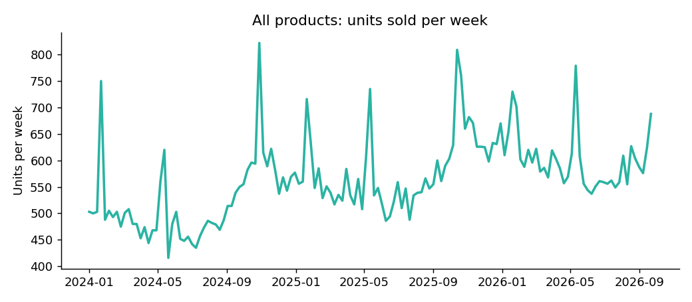
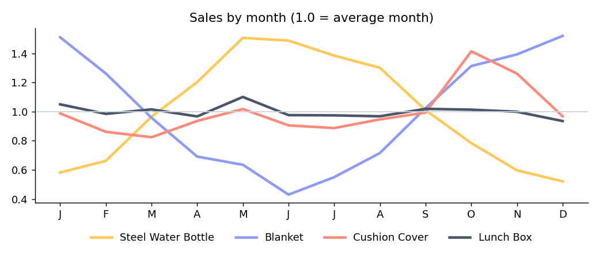
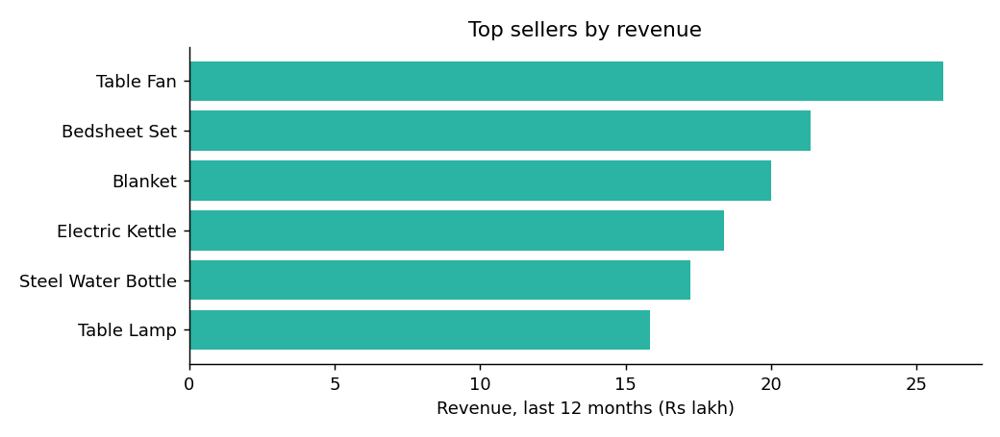
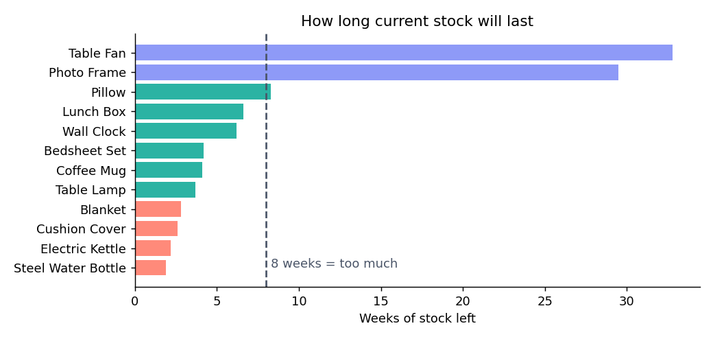

# Data-quality & EDA memo - NorthBay Living
*Prepared for the Head of Operations. Data: 12 products, daily sales Jan 2024 - Sep 2026.*

## 1. Data quality: what we found and fixed
| Issue                         |   Rows | How we handled it                      |
|:------------------------------|-------:|:---------------------------------------|
| Inconsistent category labels  |      3 | Trimmed spaces, unified capitalisation |
| Duplicate sales rows          |     25 | Removed                                |
| Missing units_sold            |     30 | Recovered as revenue / unit_price      |
| Rows left with missing values |      0 | None - all fixed                       |

All fixes are done in code (`src/pipeline.py`), so the same steps run again next month. Nothing was fixed by hand.

## 2. What the data shows

## 3. Business insights (plain language)
1. **Demand follows the seasons.** Water bottles sell about 2.9x more in their best month (May) than their weakest. Blankets peak in Dec (3.5x swing). Cushion covers jump before Diwali (Oct). Ordering the same amount every month will always be wrong for these.
2. **Three products bring in most of the money.** Table Fan, Bedsheet Set, Blanket give 41% of the last 12 months' revenue among the 12 products. A stockout here hurts most.
3. **Sales events work.** On sale days a product sells about 1.4x its normal daily amount. The Diwali sale (2-8 Nov) falls inside our 6-week window, so demand is expected to rise.
4. **Weekends are busier.** Weekend days sell about 1.16x a weekday, so stock should be in place before Friday.
5. **Dead stock exists.** Table Fan, Photo Frame hold more than 8 weeks of stock. Together about Rs 684,542 of cash sits in them.

## 4. Limits
The data is simulated and covers about 2.7 years, so a full-year pattern is seen only twice. Forecasts for a new product would need category averages.
